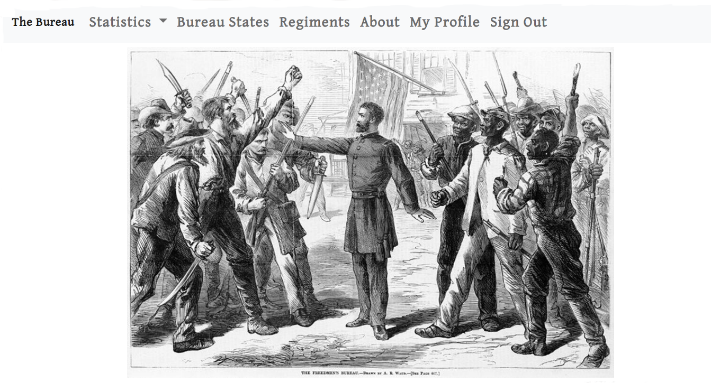

The Bureau
==========

Keep track of personnel of Bureau of Refugees, Freedmen and Abandoned Lands, with emphasis on Veteran Reserve Corps membership.

.. image:: https://img.shields.io/badge/built%20with-Cookiecutter%20Django-ff69b4.svg
     :target: https://github.com/pydanny/cookiecutter-django/
     :alt: Built with Cookiecutter Django

.. image:: https://travis-ci.org/clairempr/bureau.svg?branch=master
    :target: https://travis-ci.org/clairempr/bureau?branch=master
    :alt: Travis CI Build Status

.. image:: https://circleci.com/gh/clairempr/bureau.svg?style=svg
    :target: https://circleci.com/gh/clairempr/bureau
    :alt: CircleCI Build Status

.. image:: https://coveralls.io/repos/github/clairempr/bureau/badge.svg?branch=master&kill_cache=1
    :target: https://coveralls.io/github/clairempr/bureau
    :alt: Test Coverage on Coveralls

.. image:: https://pyup.io/repos/github/clairempr/bureau/shield.svg
    :target: https://pyup.io/repos/github/clairempr/bureau/
    :alt: Updates

:License: Apache Software License 2.0

Background
--------------

The Bureau of Refugees, Freedmen and Abandoned Lands, commonly known as the Freedmen's Bureau, was established at the
close of the American Civil War with the purpose of helping the newly emancipated become integrated into free society by
establishing and inspecting schools, promoting fair and honest labor practices, ensuring that proper justice was done in
the civil courts, and supplying clothing and rations to the needy, among other things. I first became interested in the
Freedmen's Bureau some years ago when reading the personal correspondence of its Commissioner, General Oliver Otis Howard,
during the period of the war and after. By the fall of 2018 I had gathered an embarrassing amount of mostly unstructured
data on individual Bureau employees, and being a Django developer, I found that the most convenient way of making some
sense of what I had collected.

This application is... extremely specific.

Basic Commands
--------------

Setting Up Your Users
^^^^^^^^^^^^^^^^^^^^^

* To create a **normal user account**, just go to Sign Up and fill out the form. Once you submit it, you'll see a "Verify Your E-mail Address" page. Go to your console to see a simulated email verification message. Copy the link into your browser. Now the user's email should be verified and ready to go.

* To create an **superuser account**, use this command::

    $ python manage.py createsuperuser

For convenience, you can keep your normal user logged in on Chrome and your superuser logged in on Firefox (or similar), so that you can see how the site behaves for both kinds of users.

Type checks
^^^^^^^^^^^

Running type checks with mypy:

::

  $ mypy bureau

Test coverage
^^^^^^^^^^^^^

To run the tests, check your test coverage, and generate an HTML coverage report::

    $ coverage run -m pytest
    $ coverage html
    $ open htmlcov/index.html

Running tests with py.test
~~~~~~~~~~~~~~~~~~~~~~~~~~

::

  $ pytest

Deployment
----------

The following details how to deploy this application.

Docker
^^^^^^

See detailed `cookiecutter-django Docker documentation`_.

.. _`cookiecutter-django Docker documentation`: http://cookiecutter-django.readthedocs.io/en/latest/deployment-with-docker.html

Credits
----------

Freedmen's Bureau image: Waud, Alfred R. , Artist. The Freedmen's Bureau / Drawn by A.R. Waud. Photograph. Retrieved from the Library of Congress, <www.loc.gov/item/92514996/>.

Selected Sources
----------
* Freedmen's Bureau Records, held and microfilmed by `The National Archives`: https://www.archives.gov/research/african-americans/freedmens-bureau, images accessed from `FamilySearch`: https://www.familysearch.org/search/collection/list/?cqs=freedmen
* Military service records from `Fold3`: https://www.fold3.com/
* Personal details from `Find A Grave`: https://www.findagrave.com/ and `Ancestry`: https://www.ancestry.com/
* Field record of officers of the Veteran Reserve Corps, from the commencement to the close of the rebellion. Scriver & Swing, [1865?], Washington, D.C., `U.S. National Library of Medicine Digital Collections`, http://resource.nlm.nih.gov/101177853.
* Bean, Christopher B. Too Great a Burden to Bear: The Struggle and Failure of the Freedmen's Bureau in Texas. Fordham University Press, 2016.
* Cimbala, Paul A. "On the Front Line of Freedom: Freedmen's Bureau Officers and Agents in Reconstruction Georgia, 1865-1868." The Georgia Historical Quarterly, vol. 76, no. 3, 1992, pp. 577–611. JSTOR, www.jstor.org/stable/40582592.
* Cimbala, Paul. Under the Guardianship of the Nation: The Freedmen's Bureau and the Reconstruction of Georgia, 1865-1870. University of Georgia Press, 2003.
* Finley, Randy. From Slavery to Uncertain Freedom: The Freedman’s Bureau in Arkansas 1865-1869. The University of Arkansas Press, 1996.
* Richter, William. Overreached on All Sides: The Freedmen's Bureau Administrators in Texas, 1865-1868. Texas A&M University Press, 1991.
